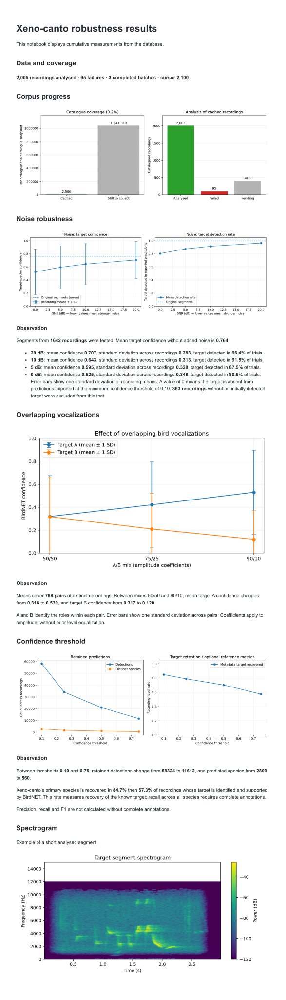

# Bird Bioacoustics

Experiments with BirdNET 3.0 on bird recordings from [Xeno-canto](https://xeno-canto.org/), measuring sensitivity to noise, overlapping vocalizations, and confidence thresholds. The project aims to cover the full bird catalogue through resumable batches.

## Prerequisites

- [Python](https://www.python.org/) 3.12 or 3.13
- [uv](https://docs.astral.sh/uv/)
- An [Xeno-canto API key](https://xeno-canto.org/account) to run batches - _viewing saved results does not require a key_


## Installation

```bash
uv sync --frozen
uv run playwright install chromium
```

## Usage

### Jupyter Notebook

```bash
uv run jupyter lab
```

### Batch

Copy `.env.example` to `.env` and set `XENO_CANTO_API_KEY` before running a batch. Each execution processes one batch and resumes from the saved cursor.

```bash
uv run app models
uv run app batch \
    --batch-size [integer] \
    --workers [integer] \
    --producers [integer] \
    --inference-batch-size [integer]
uv run app report
uv run app status
```

- `models` downloads and caches the configured model without processing recordings.
- `report` regenerates cumulative summaries and plots, refreshes the saved notebook outputs, and exports the notebook as SVG.
- `status` displays the current progress.

## Results

_From [`notebook.ipynb`](notebook.ipynb)_



## Development

```bash
uv run mypy
uv run pyright
uv run ruff check .
uv run ruff format .
```
