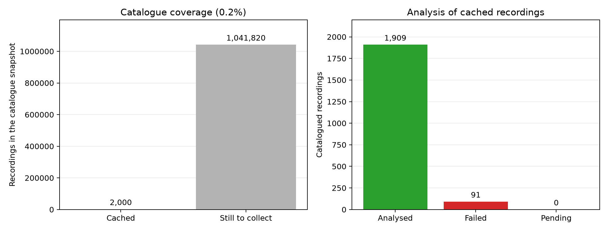
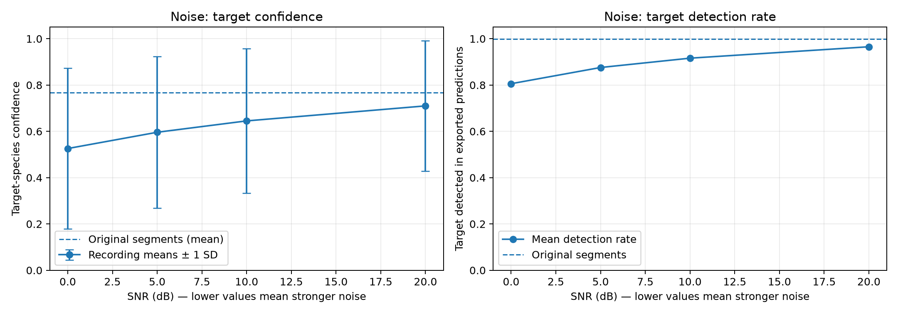
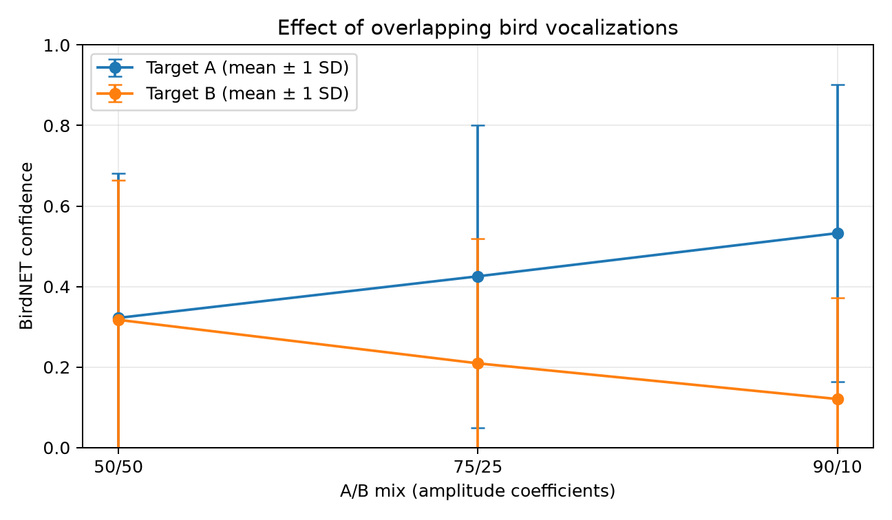
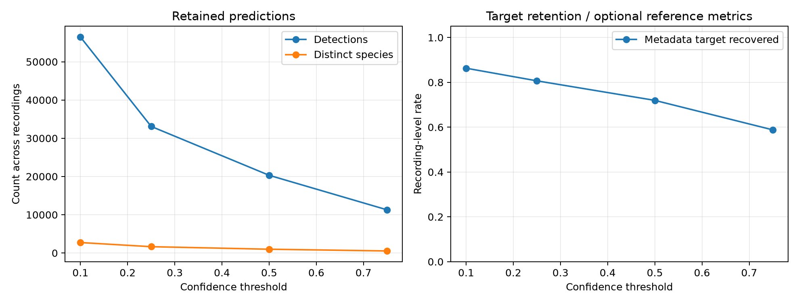

# Bird Bioacoustics

Experiments with BirdNET 3.0 on bird recordings from [Xeno-canto](https://xeno-canto.org/), measuring sensitivity to noise,
overlapping vocalizations, and confidence thresholds. The project aims to cover the full bird catalogue through resumable batches of 1,000 recordings.

## Prerequisites

- [Python](https://www.python.org/) 3.12 or 3.13
- [uv](https://docs.astral.sh/uv/)
- An [Xeno-canto API key](https://xeno-canto.org/account) to run batches - _viewing saved results does not require a key_

## Usage

### Jupyter Notebook

```bash
uv sync --frozen
uv run jupyter lab
```

Open [`notebook.ipynb`](notebook.ipynb) to display the saved results and plots.

### Batch

Copy `.env.example` to `.env` and set `XENO_CANTO_API_KEY` before running a batch. Each execution processes one batch and resumes from the saved cursor.

```bash
uv run app batch
uv run app report
uv run app status
```

- `report` regenerates cumulative CSV summaries and PNG plots in [`data/results`](data/results).
- `status` displays the current progress.

## Results

_**2,000 recordings attempted**, **1,909 analysed**, and **91 failures**._
 
This represents about **0.19%** of the catalogue snapshot of 1,043,820 recordings. The plots summarize all measurements stored so far.



### Noise

Across **1,594 recordings**, mean target confidence drops from **0.768** without added noise to **0.526** at 0 dB SNR. The target detection rate drops from **99.9%** to **80.6%** as noise increases.



### Overlapping vocalizations

Across **775 recording pairs**, changing the mix from 50/50 to 90/10 raises mean confidence for target A from **0.322** to **0.533**, while confidence for target B falls from **0.317** to **0.121**. A and B identify the two species in each pair.



### Confidence thresholds

Raising the threshold from **0.10** to **0.75** reduces retained detections from **56,475** to **11,285**. Recovery of the main species listed on Xeno-canto falls from **86.3%** to **58.8%** across **1,847 recordings** with an identified target covered by BirdNET.



## Development

```bash
uv run mypy
uv run pyright
uv run ruff check .
uv run ruff format --check .
```
