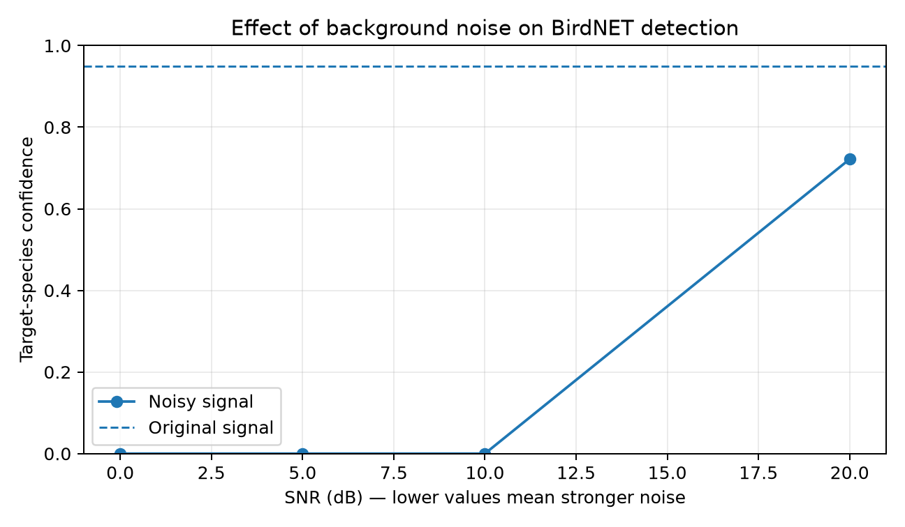
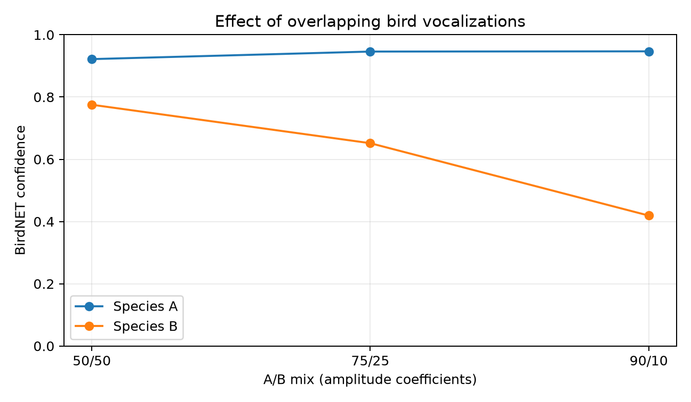
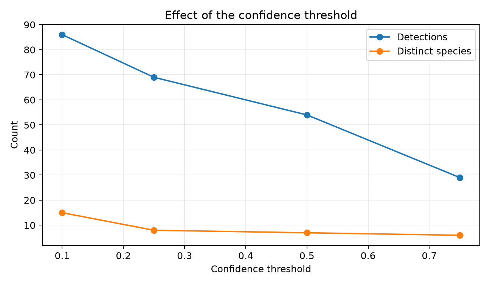
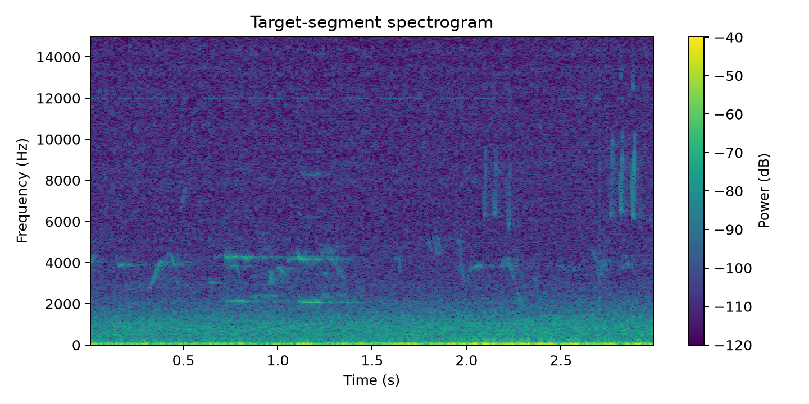

# Bird Bioacoustics

Experiments on bird bioacoustics using BirdNET 3.0 to evaluate robustness to background noise, overlapping vocalizations, and confidence thresholds.

## Prerequisites

- [Python](https://www.python.org/) 3.12 or 3.13
- [uv](https://docs.astral.sh/uv/)

## Usage

```bash
uv sync --frozen
uv run jupyter lab
```

## Results

### 1. Background noise

Added noise reduces confidence in the **Dark-eyed Junco (*Junco hyemalis*)** from **0.949** to **0.722** at 20 dB SNR. At 10 dB and below, the species is no longer detected. Lower SNR values mean more noise.

| Condition | Target confidence | Rank |
| --- | ---: | ---: |
| Original segment | 0.949 | 1 |
| 20 dB SNR | 0.722 | 2 |
| 10 dB SNR | Not returned | — |
| 5 dB SNR | Not returned | — |
| 0 dB SNR | Not returned | — |



### 2. Overlapping vocalizations

Both species remain detected in all three mixtures. Confidence in **species A (Dark-eyed Junco)** stays high, while confidence in **species B (Black-capped Chickadee)** falls from **0.775** to **0.419** as its contribution decreases.

The A/B ratios are amplitude weights. The two segments have different original signal levels.

| A/B amplitude coefficients | Confidence A | Confidence B |
| --- | ---: | ---: |
| 50/50 | 0.922 | 0.775 |
| 75/25 | 0.946 | 0.652 |
| 90/10 | 0.947 | 0.419 |



### 3. Confidence threshold

Raising the confidence threshold from **0.10** to **0.75** reduces retained detections from **86 to 29** and distinct predicted species from **15 to 6**. A higher threshold keeps fewer predictions; these counts alone do not show whether they are correct.

| Confidence threshold | Retained detections | Distinct predicted species |
| --- | ---: | ---: |
| 0.10 | 86 | 15 |
| 0.25 | 69 | 8 |
| 0.50 | 54 | 7 |
| 0.75 | 29 | 6 |



### Target-segment spectrogram



The spectrogram shows how frequencies change over the original three-second segment. Time is on the horizontal axis, frequency on the vertical axis, and brighter colors indicate stronger energy.

## Result files

All CSV files and figures are available in [`results/`](results/), including the [baseline predictions](results/baseline_predictions.csv) and predictions for each noisy or mixed segment.

## Limits

These observations come from one recording and a few segments. More recordings, repeated trials, and reference annotations would be needed to evaluate BirdNET's overall accuracy.
